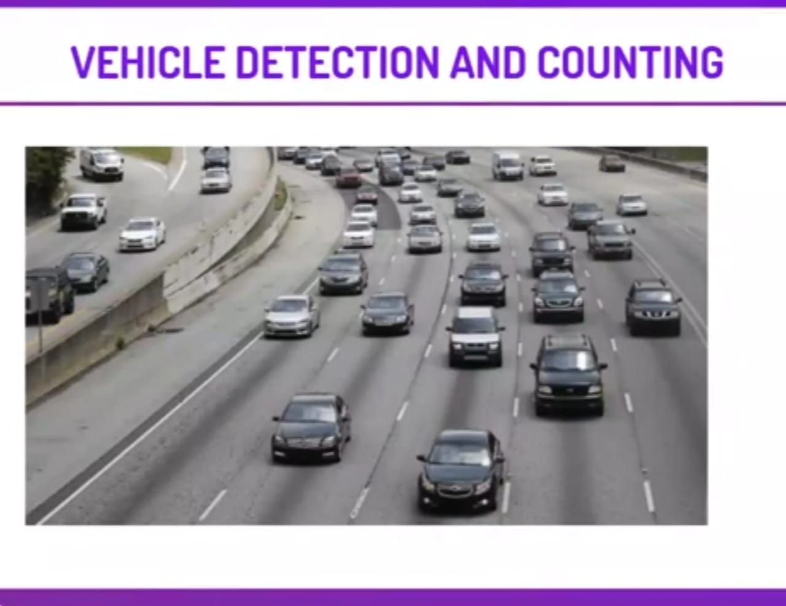

  
 

<h3> Link -  https://detect-and-count-vehicle.herokuapp.com/ </h3>

 <i> <h2>Vehicle Detection and Counting</h2>

<h3><i> IN THIS PROJECT. WE WILL BE WORKING ON DETECTING AND COUNTING VEHICLES IN A GIVEN IMAGE OR A VIDEO. WE WILL BE USING OPENCV FOR IMAGE PROCESSING AND HAAR CASCADE WHICH IS USED FOR OBJECT DETECTION. WE CAN ALSO CREATE OUR OWN CUSTOMIZED HAAR CASCADE CLASSIFIER.</h2>
  

 
<h2>The Steps to solve the problem

<h3>
1. LOADING THE IMAGE FROM THE INTERNET  

2. RESIZING THE IMAGE AND CONVERT IT INTO A NUMPY ARRAY   

3.CONVERTING IMAGE INTO GREYSCALE  

4. LOAD THE XML FILE WHICH CONTAINS THE HAAR CASCADE.  

5. USING HAAR CASCADE TO DETECT THE VEHICLE IN THE IMAGE.  

6. USE THE CONTOURS TO CREATE A RECTANGLE AROUND ALL THE DETECTED VEHICLES(CARS)  

7. SIMILARLY WE WILL PERFORM THESE OPERATIONS FOR ANOTHER IMAGE FOR BUS DETECTION.  

8. WILL US BUS_DETECTION XML FOR BUS DETECTION  

9. WE WILL ALSO PERFORM THESE OPERATIONS ON A VIDEO.  

 10. SAVE THE VIDEO WITH OBJECT DETECTION.   </h3>

     
  
 
<h2>Vehicle detection and counting

<h3> As haar cascade is used for object detection we have a very vast scope for this project. It can be used for any type of object detection. We can also create our own custom haar cascade for specific objects.

With this kind of identification and localization, object detection can be used to count objects in a scene and determine and track their precise locations, all while accurately labeling them. </h3>
    
  
  <h2>Deploying on Heroku

<h3> This is the last part where we will deploy the Django application on Heroku using the connections to github. </h3>
    

 

     
  
  <h1> Screenshots </h1>
  <h2> Input Screen </h2>

   
  
    
  
<h2> Output Screen </h2> 

   
  
    

### Give It a Star if you liked the project 

